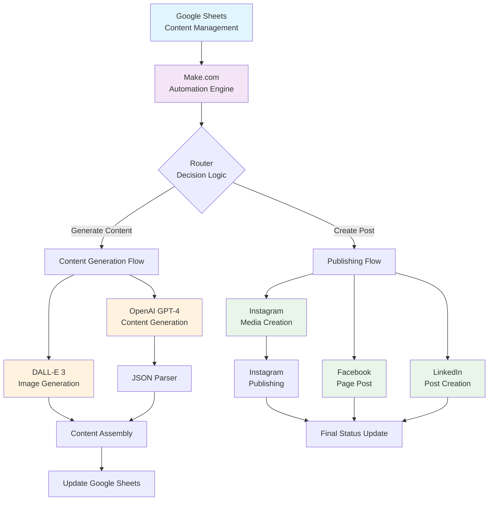

# System Architecture Diagram

## High-Level Architecture



## Detailed Component Architecture

### Data Flow Layer
```
┌─────────────────────────────────────────────────────────────────┐
│                    DATA FLOW ARCHITECTURE                       │
├─────────────────────────────────────────────────────────────────┤
│                                                                 │
│  Input Layer        Processing Layer         Output Layer       │
│  ┌─────────────┐    ┌─────────────────┐    ┌─────────────────┐  │
│  │Google Sheets│───▶│   Make.com      │───▶│Social Platforms │  │
│  │             │    │   Workflow      │    │                 │  │
│  │• Ideas      │    │                 │    │• Facebook       │  │
│  │• Control    │    │• Router Logic   │    │• Instagram      │  │
│  │• Status     │    │• AI Processing  │    │• LinkedIn       │  │
│  │             │    │• Error Handling │    │                 │  │
│  └─────────────┘    └─────────────────┘    └─────────────────┘  │
│                                                                 │
└─────────────────────────────────────────────────────────────────┘
```

### AI Processing Pipeline
```
┌─────────────────────────────────────────────────────────────────┐
│                     AI PROCESSING PIPELINE                      │
├─────────────────────────────────────────────────────────────────┤
│                                                                 │
│ Input Idea                                                      │
│     │                                                           │
│     ▼                                                           │
│ ┌─────────────────┐     ┌─────────────────┐                   │
│ │System Prompt    │────▶│OpenAI GPT-4     │                   │
│ │• Brand Voice    │     │• Content Gen    │                   │
│ │• Platform Rules │     │• JSON Response  │                   │
│ │• Format Specs   │     │• Quality Control│                   │
│ └─────────────────┘     └─────────────────┘                   │
│                                │                               │
│                                ▼                               │
│ ┌─────────────────┐     ┌─────────────────┐                   │
│ │Image Prompt     │────▶│DALL-E 3         │                   │
│ │• Visual Style   │     │• Image Gen      │                   │
│ │• Brand Colors   │     │• 1024x1024      │                   │
│ │• Context        │     │• Public URL     │                   │
│ └─────────────────┘     └─────────────────┘                   │
│                                │                               │
│                                ▼                               │
│                     ┌─────────────────┐                       │
│                     │Platform Content │                       │
│                     │• Facebook Post  │                       │
│                     │• Instagram Post │                       │
│                     │• LinkedIn Post  │                       │
│                     │• Social Image   │                       │
│                     └─────────────────┘                       │
│                                                                 │
└─────────────────────────────────────────────────────────────────┘
```

### Platform Integration Architecture
```
┌─────────────────────────────────────────────────────────────────┐
│                 PLATFORM INTEGRATION LAYER                      │
├─────────────────────────────────────────────────────────────────┤
│                                                                 │
│ ┌─────────────────┐  ┌─────────────────┐  ┌─────────────────┐  │
│ │   INSTAGRAM     │  │    FACEBOOK     │  │    LINKEDIN     │  │
│ │                 │  │                 │  │                 │  │
│ │• Business API   │  │• Pages API      │  │• Share API      │  │
│ │• Media Objects  │  │• Post Creation  │  │• Professional   │  │
│ │• 2-Step Publish │  │• Image Attach   │  │• Image Support  │  │
│ │• Caption + Tags │  │• Engagement     │  │• B2B Optimized  │  │
│ │                 │  │                 │  │                 │  │
│ └─────────────────┘  └─────────────────┘  └─────────────────┘  │
│         │                     │                     │          │
│         └─────────────────────┼─────────────────────┘          │
│                               │                                │
│                               ▼                                │
│                    ┌─────────────────┐                        │
│                    │STATUS TRACKING  │                        │
│                    │• Success/Fail   │                        │
│                    │• Timestamps     │                        │
│                    │• Error Logs     │                        │
│                    │• Retry Logic    │                        │
│                    └─────────────────┘                        │
│                                                                 │
└─────────────────────────────────────────────────────────────────┘
```

## Security & Access Control Architecture

```
┌─────────────────────────────────────────────────────────────────┐
│                    SECURITY ARCHITECTURE                        │
├─────────────────────────────────────────────────────────────────┤
│                                                                 │
│ API Key Management          Access Control          Monitoring  │
│ ┌─────────────────┐        ┌─────────────────┐    ┌──────────┐  │
│ │• OpenAI Keys    │        │• Service Acct   │    │• Logs    │  │
│ │• Social Tokens  │        │• OAuth Tokens   │    │• Alerts  │  │
│ │• Encrypted      │        │• Permissions    │    │• Metrics │  │
│ │• Rotated        │        │• Rate Limits    │    │• Audit   │  │
│ └─────────────────┘        └─────────────────┘    └──────────┘  │
│                                                                 │
└─────────────────────────────────────────────────────────────────┘
```

## Error Handling & Recovery Architecture

```
┌─────────────────────────────────────────────────────────────────┐
│                 ERROR HANDLING ARCHITECTURE                     │
├─────────────────────────────────────────────────────────────────┤
│                                                                 │
│ Detection Layer      Recovery Layer         Prevention Layer    │
│ ┌─────────────────┐  ┌─────────────────┐   ┌─────────────────┐  │
│ │• API Failures   │  │• Retry Logic    │   │• Rate Limiting  │  │
│ │• Timeout Errors │  │• Fallback APIs  │   │• Input Valid.   │  │
│ │• Invalid Data   │  │• Manual Queue   │   │• Health Checks  │  │
│ │• Rate Limits    │  │• Error Alerts   │   │• Monitoring     │  │
│ └─────────────────┘  └─────────────────┘   └─────────────────┘  │
│                                                                 │
└─────────────────────────────────────────────────────────────────┘
```

## Performance Optimization Architecture

### Execution Flow Optimization
```
Parallel Processing Model:

┌─────────────────────────────────────────────────────────────────┐
│                    PERFORMANCE OPTIMIZATION                     │
├─────────────────────────────────────────────────────────────────┤
│                                                                 │
│ Sequential Operations         Parallel Operations               │
│ ┌─────────────────┐          ┌─────────────────┐               │
│ │1. Trigger       │          │• Instagram      │               │
│ │2. Router        │          │• Facebook       │               │
│ │3. Content Gen   │   ────▶  │• LinkedIn       │               │
│ │4. Image Gen     │          │                 │               │
│ │5. Assembly      │          │(Simultaneous    │               │
│ └─────────────────┘          │ Publishing)     │               │
│                              └─────────────────┘               │
│                                                                 │
│ Optimization Strategies:                                        │
│ • Async API calls where possible                               │
│ • Connection pooling                                           │
│ • Smart caching                                                │
│ • Batch processing                                             │
│                                                                 │
└─────────────────────────────────────────────────────────────────┘
```

## Scaling Architecture

### Multi-Account Management
```
┌─────────────────────────────────────────────────────────────────┐
│                     SCALING ARCHITECTURE                        │
├─────────────────────────────────────────────────────────────────┤
│                                                                 │
│ Account Segmentation                                            │
│ ┌─────────────────┐  ┌─────────────────┐  ┌─────────────────┐  │
│ │Personal Brand   │  │Business Account │  │Client Accounts  │  │
│ │• Scenario 1     │  │• Scenario 2     │  │• Scenarios 3-N  │  │
│ │• Custom Voice   │  │• Corp Voice     │  │• Custom Configs │  │
│ │• Personal APIs  │  │• Business APIs  │  │• Isolated APIs  │  │
│ └─────────────────┘  └─────────────────┘  └─────────────────┘  │
│                                                                 │
│ Resource Management                                             │
│ ┌─────────────────────────────────────────────────────────────┐ │
│ │• Load Balancing across API keys                            │ │
│ │• Cost allocation per account                               │ │
│ │• Performance monitoring per scenario                       │ │
│ │• Centralized error handling and recovery                   │ │
│ └─────────────────────────────────────────────────────────────┘ │
│                                                                 │
└─────────────────────────────────────────────────────────────────┘
```

## Technology Stack Details

### Core Components
```
┌─────────────────────────────────────────────────────────────────┐
│                      TECHNOLOGY STACK                           │
├─────────────────────────────────────────────────────────────────┤
│                                                                 │
│ Automation Layer    │ AI/ML Layer        │ Integration Layer   │
│ ┌─────────────────┐ │ ┌─────────────────┐ │ ┌─────────────────┐ │
│ │• Make.com       │ │ │• OpenAI GPT-4   │ │ │• Google Sheets  │ │
│ │• Workflow Engine│ │ │• DALL-E 3       │ │ │• Instagram API  │ │
│ │• Router Logic   │ │ │• JSON Parsing   │ │ │• Facebook API   │ │
│ │• Error Handling │ │ │• Prompt Eng.    │ │ │• LinkedIn API   │ │
│ │• Scheduling     │ │ │• Quality Control│ │ │• OAuth 2.0      │ │
│ └─────────────────┘ │ └─────────────────┘ │ └─────────────────┘ │
│                                                                 │
│ Data Layer          │ Security Layer     │ Monitoring Layer    │
│ ┌─────────────────┐ │ ┌─────────────────┐ │ ┌─────────────────┐ │
│ │• Google Sheets  │ │ │• API Key Mgmt   │ │ │• Execution Logs │ │
│ │• JSON Objects   │ │ │• Access Control │ │ │• Performance    │ │
│ │• Status Tracking│ │ │• Token Rotation │ │ │• Cost Tracking  │ │
│ │• Version History│ │ │• Audit Trails   │ │ │• Error Alerts   │ │
│ └─────────────────┘ │ └─────────────────┘ │ └─────────────────┘ │
│                                                                 │
└─────────────────────────────────────────────────────────────────┘
```

## Deployment Architecture

### Production Environment
```
Development → Testing → Staging → Production

┌─────────────────────────────────────────────────────────────────┐
│                    DEPLOYMENT PIPELINE                          │
├─────────────────────────────────────────────────────────────────┤
│                                                                 │
│ Environment Setup                                               │
│ ┌─────────────────┐  ┌─────────────────┐  ┌─────────────────┐  │
│ │   DEVELOPMENT   │  │     STAGING     │  │   PRODUCTION    │  │
│ │                 │  │                 │  │                 │  │
│ │• Test APIs      │  │• Production APIs│  │• Live APIs      │  │
│ │• Sample Data    │  │• Real Data Copy │  │• Production Data│  │
│ │• Debug Logging  │  │• Performance    │  │• Monitoring     │  │
│ │• Manual Trigger │  │• Automated Test │  │• Full Automation│  │
│ └─────────────────┘  └─────────────────┘  └─────────────────┘  │
│                                                                 │
│ Quality Gates                                                   │
│ • Unit Testing → Integration Testing → User Acceptance         │
│ • Performance Testing → Security Testing → Production Ready    │
│                                                                 │
└─────────────────────────────────────────────────────────────────┘
```

This architecture provides a robust, scalable foundation for AI-powered social media automation while maintaining security, reliability, and performance optimization.